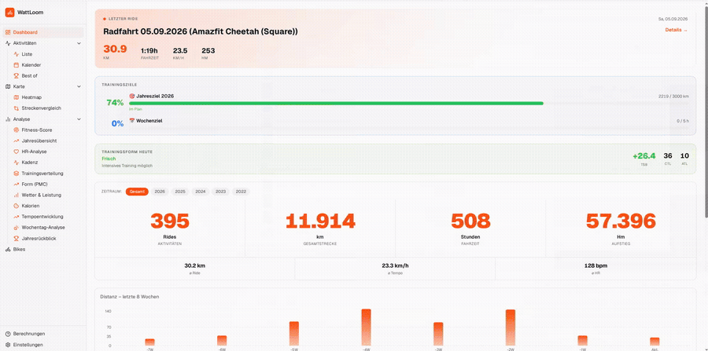
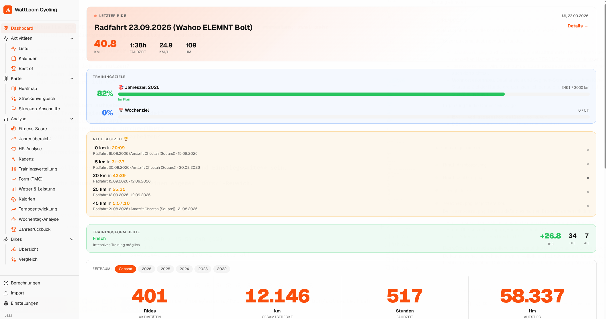
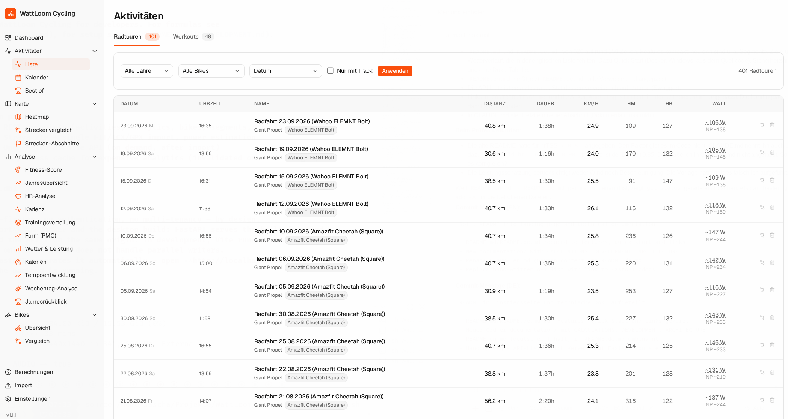
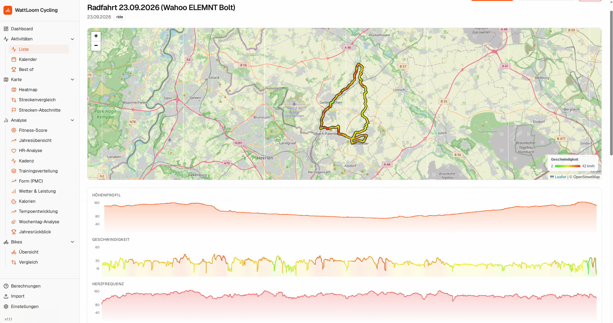
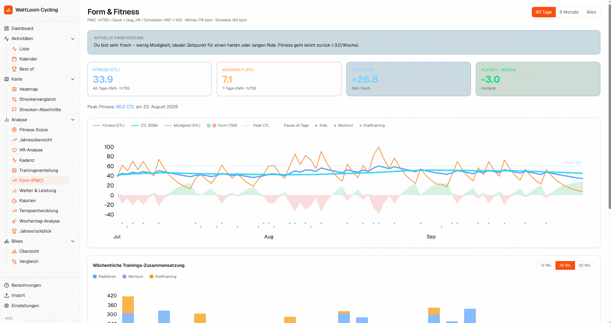
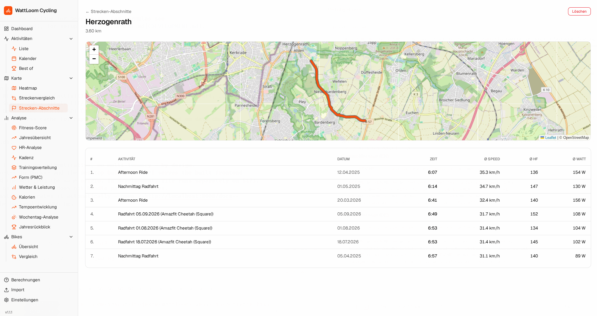
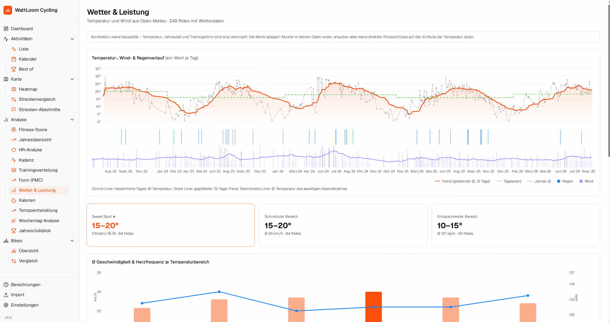
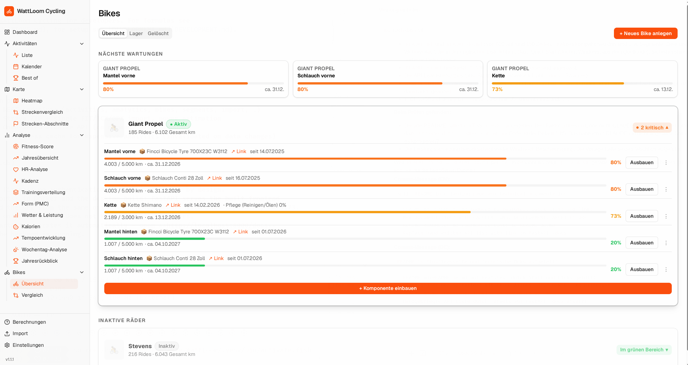

# WattLoom Cycling

> 🇬🇧 [English README](README.md)

**Local-first Strava-Analytics für Radfahrer.**

Analysiere deine komplette Strava-Historie lokal – ohne Strava-API-Zugriff, ohne Cloud-Upload.
Einfach den ZIP-Export herunterladen, importieren, fertig.



⭐ **Features**
📊 Trainingsanalyse · 🚴 Bike-Management · 🌦 Wetter & Performance · 🏆 PRs & Best Efforts ·
🗺 Strecken & Heatmap · 🔒 100 % lokal


[](https://buymeacoffee.com/saschalerst)

---

### Warum WattLoom Cycling?

**Keine API.**
Strava-ZIP-Export importieren, fertig.

**Keine Cloud.**
Deine Aktivitäten bleiben auf deinem eigenen Rechner.

**Kein Abo.**
Komplett Open Source (AGPL-3.0) – kein Lizenzschlüssel, nie.

**Ein Dashboard.**
Training, Performance, Wetter und Bike-Wartung an einem Ort.

### Vergleich mit bestehenden Lösungen

| | WattLoom Cycling | Strava | GoldenCheetah | Intervals.icu |
|---|---|---|---|---|
| Lokale Daten | ✅ | ❌ | ✅ | ❌ |
| Strava-API nötig | ❌ | — | optional | optional |
| Cloud-Account nötig | ❌ | ✅ | ❌ | ✅ |
| Web-UI | ✅ | ✅ | ❌ (Desktop-App) | ✅ |
| Open Source | ✅ | ❌ | ✅ | ❌ |

Der Funktionsumfang der anderen Tools ändert sich laufend – dazu bitte deren aktuelle Doku
prüfen. WattLoom bringt mit: Bike-Wartung (Verschleiß, Teilelager, Kosten pro km) und
Wetteranalyse für jede Fahrt, beides kostenlos.


---

## Screenshots

<table>
  <tr>
    <td width="50%"><a href="documentation/screenshots/dashboard.png"></a><br><sub>Dashboard</sub></td>
    <td width="50%"><a href="documentation/screenshots/activitieslist.png"></a><br><sub>Aktivitätsliste</sub></td>
  </tr>
  <tr>
    <td width="50%"><a href="documentation/screenshots/activitiesdetails.png"></a><br><sub>Aktivitätsdetail mit Speed-farbiger Karte</sub></td>
    <td width="50%"><a href="documentation/screenshots/form.png"></a><br><sub>Form & Fitness (PMC)</sub></td>
  </tr>
  <tr>
    <td width="50%"><a href="documentation/screenshots/segments.png"></a><br><sub>Eigenes Segment mit allen Durchgängen</sub></td>
    <td width="50%"><a href="documentation/screenshots/weather.png"></a><br><sub>Wetter & Leistung</sub></td>
  </tr>
  <tr>
    <td width="50%"><a href="documentation/screenshots/bikes.png"></a><br><sub>Bikes & Komponenten-Verschleiß</sub></td>
  </tr>
</table>

---

## Features

| Bereich | Was es kann |
|---------|-------------|
| **Dashboard** | Letzte Fahrt, Trainingsform (TSB/CTL/ATL), Trainingsziele, Verschleiß-Warnungen, neue Bestzeiten, Kennzahlen, Distanz- und Volumen-Charts |
| **Aktivitäten** | Radtouren und Workouts mit Filtern; Detailansicht mit Karte, Höhen-/Speed-/HF-Profil, Wetter, Fotos, geschätzter Leistung |
| **Trainingslast** | Formkurve (CTL/ATL/TSB, hrTSS), HF-Zonen, 80/20-Trainingsverteilung, Fitness-Fingerprint-Score |
| **Leistung** | Bestzeiten je Distanz (5–70 km), Tempoentwicklung, aerobe Effizienz, HF-Kurve, Kadenz |
| **Strecken** | Heatmap aller Tracks, ähnliche Fahrten über echte Streckenübereinstimmung finden, eigene Segmente mit Vergleich aller Durchgänge |
| **Wetter** | Speed vs. Temperatur und Wind, Wetterverlauf über alle Jahre (kostenlos über Open-Meteo) |
| **Bikes** | Verschleiß je Komponente, Wartungsliste, Teilelager, Unterhaltskosten pro 100 km, Bike-Vergleich |
| **Übersichten** | Jahresfortschritt mit Prognose, Jahresvergleich, Kalender, Werktag vs. Wochenende, Kalorien, „Wrapped"-Jahresrückblick |
| **Import** | Strava-ZIP-Export plus einzelne FIT/TCX/GPX-Dateien (z. B. direkt von der Uhr) |
| **Sonstiges** | Optionale Betablocker-HF-Korrektur, Oberfläche auf Deutsch/Englisch, 5 Themes |

Wie jeder Wert berechnet wird – und welche Werte Schätzungen sind – steht in
[CALCULATIONS.md](documentation/CALCULATIONS.md) (Englisch).

---

## Loslegen

### Docker (empfohlen)

Voraussetzung: [Docker Desktop](https://www.docker.com/products/docker-desktop/) (Windows/macOS) oder
Docker Engine mit Compose-Plugin (Linux).

```bash
docker compose up --build
```

**http://localhost:8000** öffnen. Deine Daten liegen im lokalen Ordner `wattloom-data/` und
bleiben über Container-Neustarts erhalten. Den Strava-Export-ZIP nach `wattloom-data/download/` legen.

Der Port ist standardmäßig nur an `127.0.0.1` gebunden, WattLoom ist also nur von diesem Rechner
aus erreichbar. Für Zugriff von anderen Geräten im LAN mit
`WATTLOOM_BIND=0.0.0.0 docker compose up --build` starten.

### Windows (Desktop-Version)

`WattLoom-windows.zip` aus den [Releases](https://github.com/Ashikaga1974/WattLoom/releases)
herunterladen, an beliebiger Stelle entpacken und `WattLoom.exe` starten – der Browser öffnet
sich automatisch auf **http://localhost:8000**.

- Deine Daten liegen unter `%APPDATA%\WattLoom\data`, nicht im Programmordner – sie bleiben bei Updates erhalten.
- Den Strava-Export-ZIP in den Ordner `download\` neben `WattLoom.exe` legen.
- Automatischer Import: FIT/TCX/GPX-Dateien im Ordner `sync\` neben `WattLoom.exe` (z.B. von der
  Companion-App der Uhr abgelegt) werden importiert, solange WattLoom läuft.

**Update von v1.1.1 oder älter:** diese Versionen haben `data\` neben der `.exe` abgelegt. Vor
dem ersten Start der neuen Version entweder über den alten Ordner entpacken oder den alten
`data\`-Ordner neben die neue `WattLoom.exe` kopieren. Beim ersten Start wird er einmalig nach
`%APPDATA%\WattLoom\data` verschoben (der alte Ordner bleibt als `data.migrated-<Datum>` liegen).

### Aus dem Quellcode (Linux/macOS)

Python ≥ 3.11 und Node.js ≥ 20 – siehe [DEVELOPMENT.md](documentation/DEVELOPMENT.md) (Englisch).

### Daten importieren

1. Strava → Einstellungen → Mein Konto → Meine Daten herunterladen → ZIP herunterladen.
2. ZIP in den Ordner `download/` legen (bei Docker/Windows siehe oben).
3. Beim ersten Start führt ein Einrichtungsassistent durch den Import. Spätere Importe und
   einzelne FIT/TCX/GPX-Dateien gibt es auf der Seite **Import**.

---

## Sicherheitshinweis

WattLoom Cycling ist eine **Single-User-Anwendung für den lokalen Gebrauch**: keine
Authentifizierung, keine Benutzerverwaltung. Das ist eine bewusste Design-Entscheidung, solange
folgende Regel gilt:

- **Niemals ins offene Internet stellen** – Port 8000 (bzw. 5173) nicht öffentlich freigeben.
- Für Fernzugriff einen **VPN-Tunnel** (z. B. WireGuard, Tailscale) ins eigene LAN nutzen.
- Im eigenen, vertrauenswürdigen LAN darf WattLoom für die eigenen Geräte erreichbar sein.

---

## Dokumentation

Die technische Dokumentation ist nur auf Englisch verfügbar.

| Dokument | Inhalt |
|----------|--------|
| [Calculations](documentation/CALCULATIONS.md) | Wie Leistung, Trainingslast, Scores und Bestzeiten berechnet werden |
| [Development](documentation/DEVELOPMENT.md) | Start aus dem Quellcode, Tests, Builds, Releases |
| [Architecture](documentation/ARCHITECTURE.md) | Projektstruktur, Datenbankschema, Tech-Stack |
| API-Referenz | Eingebaut: **http://localhost:8000/docs**, solange das Backend läuft |
| [Mitwirken](CONTRIBUTING.de.md) | Bugs melden, Feature-Wünsche, Pull Requests |
| [Changelog](CHANGELOG.md) | Release-Historie |

---

## Unterstützen

WattLoom Cycling ist kostenlos und Open Source, entwickelt und gepflegt in meiner Freizeit. Wenn es dir
nützt, freue ich mich über eine Unterstützung – sie ist aber nie Voraussetzung. Kein Feature wird
jemals hinter einer Bezahlschranke landen.

[](https://buymeacoffee.com/saschalerst)

---

## Lizenz

**AGPL-3.0** – echtes Open Source. Weiterverbreitung und Modifikation sind erlaubt; wird eine
modifizierte Version (auch als gehosteter Service) Dritten zugänglich gemacht, muss der
Quellcode der Änderungen ebenfalls unter AGPL-3.0 offengelegt werden. Siehe [LICENSE](LICENSE).
Copyright (c) 2026 Ashikaga1974.
