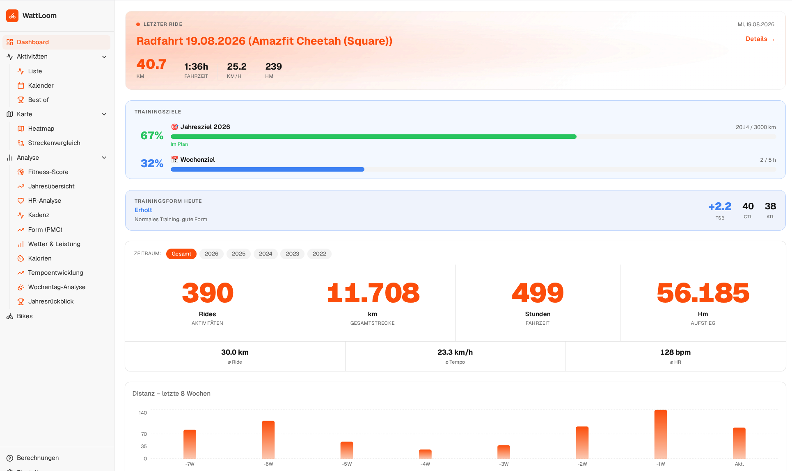

# WattLoom

Local web app for analyzing Strava export data. No Strava API access needed – everything runs locally based on a downloaded ZIP export.



> 🇩🇪 [Deutsche README](README.md)


---

## Table of Contents

- [Features](#features)
- [Prerequisites](#prerequisites)
- [Installation & Start](#installation--start)
- [Autostart via systemd (optional)](#autostart-via-systemd-optional)
- [Project structure](#project-structure)
- [API overview](#api-overview)
- [Database schema](#database-schema)
- [Supported file formats](#supported-file-formats)
- [Calculations & formulas](#calculations--formulas)
- [Configurable parameters](#configurable-parameters)
- [Known quirks](#known-quirks)
- [Tech stack](#tech-stack)
- [License](#license)

---

## Features

| Area | What it does |
|------|---------------|
| **Dashboard** | Hero banner (most recent ride), training-form widget (TSB/CTL/ATL with recommendation), animated KPI numbers (count-up), distance chart, training volume, recent activities, bike progress |
| **Activity list** | Tabs: rides (filter/sort/pagination) + workouts (sport-type badges, colored calories); watts column shows power + NP line; individual activities deletable |
| **Activity detail** | Map (Leaflet), elevation profile, speed profile (colors synced with map gradient), HR profile, weather tile, photos; "~ power" tile (physics-based estimate ~W + NP + W/kg) |
| **Year in review** | "Wrapped"-style: best rides, strongest months, day/hour heatmaps |
| **Year overview** | 4 tabs: progress (cumulative km + forecast) · year comparison (km/month per year) · volume (stacked weekly training) · time-of-day heatmap |
| **HR analysis** | 2 tabs: HR curve (best avg HR per time window 1–60 min, threshold HR, monthly HR trend) · aerobic efficiency (km/h ÷ bpm monthly, year comparison) |
| **Heatmap** | All tracks as an interactive map, filterable by year |
| **Pace trend** | Scatter + 20-ride rolling average, year comparison, seasonal heatmap (month × year) |
| **Calories** | Energy expenditure from rides + workouts; KPI tiles, stacked monthly trend with 3-month moving average, year comparison |
| **Weather & performance** | Avg speed by temperature bucket, wind-impact chart; weather data via Open-Meteo (fetch on demand) |
| **Form curve (PMC)** | CTL/ATL/TSB following training-journal methodology, hrTSS, 28-day CTL trend, ride/workout markers, assessment banner |
| **Best times** | Records and top performances; best-effort segments per distance (5–70 km, Strava-style) across all rides |
| **Bikes** | 3 tabs: overview (photo thumbnail, single-line KPIs, wear tracker as cards with progress bars + linked stock-item name, installing from stock incl. carrying over mileage of used parts, uninstalling with km entry + automatic stock return, retroactively linking already-mounted legacy components to a purchase; purchase/stock table below, inactive bikes via dropdown at the very bottom) · Deleted (history of irreversibly deleted components incl. stock link, informational only) · Comparison (km, speed, elevation, maintenance cost incl. €/100km, yearly trend, distance histogram) |
| **Workout detail** | Detail view per workout: sport hero, 4 KPI tiles, SVG intensity gauge (avg HR / max HR), history chart, average comparison |
| **Weekday analysis** | Weekday (Mon–Fri) vs. weekend (Sat–Sun): duel card with winner indicators, rides-per-weekday bars, monthly trend |
| **Route comparison** | Find similar rides (Haversine radius + distance match, then point-by-point track matching for true route overlap) |
| **Cadence analysis** | Radial distribution chart (polar chart), 6 cadence zones, monthly trend, efficiency sweet spot |
| **Fitness fingerprint** | Overall score 0–100 from CTL, aerobic efficiency, form (TSB), and consistency; arc gauge, strengths radar, 4 component cards, score history across the entire recorded period, level system (beginner → elite) |
| **Training distribution** | HR zone time aggregated monthly (polarized training check): easy/moderate/hard % tiles, stacked monthly chart, zone breakdown, automatic 80/20 insight text |
| **Calendar** | Monthly calendar: rides + workouts (marked grey), ring indicator on combo days |
| **Calculations** | Documentation of all formulas and parameters used |
| **Settings** | Weight, birth year, timezone, training goals (yearly km, weekly hours), language (DE/EN translated so far, 7 more prepared); single FIT/TCX import (Amazfit, Garmin without Strava); weather data fetch; recalculate power for all rides; WattLoomApp sync (runs automatically after every import, also triggerable manually); export/import translations as JSON; DB reset automatically backs up a copy first |
| **Multi-language support** | Full UI via react-i18next; translations live DB-backed in the `translations` table instead of the frontend bundle – new languages (e.g. translated via ChatGPT/DeepL) can be imported without any code change via Settings → Export/Import |

---

## Prerequisites

| Tool | Version | Note |
|------|---------|------|
| Python | ≥ 3.11 | `python3 --version` |
| Node.js | ≥ 20 | via [fnm](https://github.com/Schniz/fnm) or nvm recommended |
| npm | ≥ 10 | ships with Node |

---

## Installation & Start

### 1. Download your Strava export

Strava → Settings → My Account → Download your data → download the ZIP.

Place the ZIP file in the `download/` folder (auto-detected):

```
download/export_XXXXXXXX.zip
```

### 2. Set up the backend

```bash
python3 -m venv .venv
source .venv/bin/activate        # Linux/macOS
pip install -r backend/requirements.txt
```

### 3. Set up the frontend

```bash
cd frontend
npm install
```

### 4. Start

**Terminal 1 – Backend (port 8000):**
```bash
source .venv/bin/activate
python -m uvicorn backend.main:app --port 8000 --reload
```

**Terminal 2 – Frontend (port 5173):**
```bash
cd frontend
npm run dev
```

Open the app: **http://localhost:5173**

### 5. Run tests

```bash
source .venv/bin/activate
python -m pytest tests/ -v
```

102 tests in `tests/` (pytest): Haversine, physics engine, hrTSS/CTL/ATL, FIT and TCX importers, zone aggregation, beta-blocker HR correction.

### 6. Import data

In the browser: **Settings → Start import** – the importer reads the ZIP, parses all FIT/TCX/GPX files, and populates the SQLite database.

---

## Autostart via systemd (optional)

For permanent operation without manual startup:

```bash
systemctl --user enable wattloom-backend.service
systemctl --user enable wattloom-frontend.service
loginctl enable-linger $USER

# Control manually
systemctl --user start|stop|restart wattloom-backend
systemctl --user start|stop|restart wattloom-frontend

# Logs
journalctl --user -u wattloom-backend.service -f
```

Service files live in `~/.config/systemd/user/`. Stop them before debugging with VS Code so ports 8000/5173 are free.

---

## Project structure

```
WattLoom/
├── backend/
│   ├── main.py              # FastAPI app, CORS for localhost:5173
│   ├── database.py          # SQLite schema, init_db()
│   ├── api/
│   │   ├── activities.py    # /activities/* (incl. laps, power patch)
│   │   ├── analytics.py     # /analytics/* (PMC, Wrapped, calories, best-of, wind impact, fitness fingerprint, …)
│   │   ├── app_sync.py      # /app-sync/run, /app-sync/status (WattLoomApp sync subprocess)
│   │   ├── bikes.py         # /bikes, /bikes/{id}, /bikes/compare, component install/uninstall
│   │   ├── errors.py        # api_error() – unified error response format
│   │   ├── purchases.py     # /purchases – purchase/stock management (purchase_items: 1 row per physical item)
│   │   ├── heatmap.py       # /tracks/heatmap
│   │   ├── settings.py      # /settings (weight, birth year, HRmax, timezone)
│   │   ├── storage_locations.py # /storage-locations
│   │   ├── translations.py  # /translations/* (languages, export, import, {lang}/{ns})
│   │   ├── zones.py         # /activities/{id}/zones
│   │   ├── importer.py      # /import/start|status|reset|fit-file|tcx-file|gpx-file|recalculate-*
│   │   ├── tracks.py        # /activities/{id}/track
│   │   └── weather.py       # /weather/status, /weather/fetch-all (Open-Meteo)
│   ├── utils.py             # Shared: haversine_km(), haversine_m(), MS_TO_KMH
│   ├── pr_detection.py      # Snapshot diff on best-by-distance before/after import → pr_events
│   ├── weather.py           # Open-Meteo archive API: fetch_weather(lat, lon, date_utc)
│   ├── importer/
│   │   ├── pipeline.py      # run_import() – main entry point
│   │   ├── fit.py           # FIT parser (Garmin, with _SafeProcessor)
│   │   ├── fit_single.py    # single FIT import (Amazfit, Garmin without Strava)
│   │   ├── tcx.py           # TCX parser
│   │   ├── tcx_single.py    # single TCX import
│   │   ├── gpx.py           # GPX parser (tracks + routes)
│   │   ├── gpx_single.py    # single GPX import
│   │   ├── power_estimator.py # physics-based est_avg_power_w/est_norm_power_w estimation without a power meter
│   │   └── sport_codes.py   # canonical sport codes, is_ride_sport()
│   └── requirements.txt
├── frontend/
│   └── src/
│       ├── main.tsx                    # Entry point, React + router
│       ├── App.tsx                     # Root component with react-router-dom routes
│       ├── index.css                   # TailwindCSS v4, CSS custom properties, themes
│       ├── lib/
│       │   ├── activity-display.ts     # rideTitle()/workoutTitle() – display names for activities/workouts
│       │   ├── api.ts                  # Typed API client
│       │   ├── config-context.tsx      # Central parameters (smoothing, simplification, …), loaded from backend settings
│       │   ├── format.ts               # fmtKm, fmtSpeed, fmtTime, fmtDate, fmtNum, fmtHm
│       │   ├── i18n.ts                 # react-i18next setup, lazy-loads namespaces
│       │   ├── insights.ts             # Insight type + helpers for dynamic interpretation sentences
│       │   └── utils.ts                # cn() Tailwind merge helper
│       ├── components/
│       │   ├── layout/
│       │   │   └── AppSidebar.tsx      # Collapsible sidebar with sub-navigation
│       │   ├── LeafletMap.tsx          # Leaflet map (React.lazy), speed halo, hover sync
│       │   ├── RouteThumbnail.tsx      # Mini route shape without Leaflet (SVG polyline, simplify=20)
│       │   └── ui/                     # shadcn/ui base-nova components
│       ├── hooks/
│       │   └── use-mobile.ts
│       └── pages/                      # 22 pages as .tsx (tab containers bundle related views)
│           ├── DashboardPage.tsx
│           ├── ActivitiesPage.tsx
│           ├── ActivityDetailPage.tsx
│           ├── BestPage.tsx
│           ├── BikesPage.tsx           # Tabs: Overview · Deleted · Comparison (/bikes?tab=übersicht|gelöscht|vergleich)
│           ├── WorkoutDetailPage.tsx   # Workout detail with intensity gauge (/workouts/:id)
│           ├── WeekendPage.tsx         # Weekday analysis (/weekend)
│           ├── CalendarPage.tsx
│           ├── FormPage.tsx
│           ├── HeatmapPage.tsx
│           ├── HrCurvePage.tsx         # Tabs: HR curve · aerobic efficiency (/hrcurve?tab=kurve|effizienz)
│           ├── ProgressPage.tsx        # Tabs: progress · year comparison · volume · time of day (/progress?tab=…)
│           ├── SettingsPage.tsx
│           ├── StreckenPage.tsx
│           ├── TempCorrPage.tsx
│           ├── WrappedPage.tsx
│           ├── BerechnungenPage.tsx
│           ├── CadencePage.tsx
│           ├── CaloriesPage.tsx
│           ├── SpeedTrendPage.tsx      # Pace trend (/speed-trend)
│           ├── FitnessPage.tsx         # Fitness fingerprint (/fitness)
│           └── ZoneDistributionPage.tsx # Training distribution / 80-20 check (/zone-distribution)
├── data/
│   └── mybiking.db          # SQLite database (created on import)
├── download/                # Place the Strava export ZIP here
└── README.md
```

---

## API overview

```
GET  /activities                    ?limit, offset, year, bike_id, has_track, sort_by, sort_dir
GET  /activities/stats              ?year
GET  /activities/weekly             ?weeks=8
GET  /activities/monthly            ?year
GET  /activities/monthly-all
GET  /activities/other              ?year      → other sport types (running, strength, …)
GET    /activities/{id}
DELETE /activities/{id}             → deletes activity incl. track_points, media, laps
GET    /activities/{id}/laps        → lap splits
PATCH  /activities/{id}/power       → {avg_power_w} set manually (manually imported activities only)
GET  /activities/{id}/track         ?simplify, fields
GET  /activities/{id}/media
GET  /activities/{id}/zones         → HR zones + power zones
GET  /activities/{id}/similar       ?limit=10  → similar rides (Haversine + distance prefilter ±3%, then track-point matching → path_match_pct)

GET  /analytics/year-progress
GET  /analytics/time-heatmap        ?year, tz_offset
GET  /analytics/speed-hr                       → per ride: month, speed_kmh, hr, dist_km
GET  /analytics/speed-trend         ?year      → scatter, rolling avg, yearly aggregates, monthly heatmap
GET  /analytics/temp-correlation
GET  /analytics/wind-impact                    → wind strength vs. speed/HR per activity
GET  /analytics/hr-curve            ?year
GET  /analytics/pmc                            → CTL/ATL/TSB + hrTSS
GET  /analytics/wrapped             ?year, tz_offset
GET  /analytics/weekly-volume       ?weeks
GET  /analytics/best-by-distance               → fastest segment per target distance (5–70 km) across all rides (best effort)
GET    /analytics/pr-events                    → not-yet-dismissed new personal bests (dashboard widget)
DELETE /analytics/pr-events/{id}               → dismiss a PR notice
GET  /analytics/cadence             ?year      → distribution, zones, monthly trend, efficiency buckets
GET  /analytics/calories            ?year      → total_kcal, rides + workouts, monthly/yearly
GET  /analytics/weekend-weekday     ?year      → weekday vs. weekend average metrics
GET  /analytics/fitness-fingerprint            → score 0–100 from CTL, efficiency, form, consistency + history
GET  /analytics/zone-distribution   ?year        → HR zone time aggregated monthly, easy/moderate/hard % split (polarized training check)

GET  /weather/status
POST /weather/fetch-all             → fetch weather data for all activities via Open-Meteo (background job)

GET  /bikes
GET  /bikes/{id}                   → incl. current_km, components (km_since_service, pct_used, estimated_service_date, purchase_name, purchase_url derived live via the linked stock item)
PUT  /bikes/{id}                   → { name } rename bike
GET  /bikes/compare
GET  /bikes/deleted-components     → history of irreversibly deleted components (snapshot + purchase link)
PUT  /bikes/{id}/toggle-retired    → bike active ↔ inactive
GET  /bikes/{id}/image
POST /bikes/{id}/image             → upload photo (multipart)
POST /bikes/{id}/components        → install a component from stock (purchase_id, optional return_id to carry over prior mileage)
PUT  /bikes/{id}/components/{cid}  → edit component (type, km_threshold, installed_at)
PUT  /bikes/{id}/components/{cid}/reset          → mark as serviced (resets km_at_service to the current km reading)
PUT  /bikes/{id}/components/{cid}/uninstall     → {km_ridden, purchase_id?} → if stock-linked: record return + delete component
PUT  /bikes/{id}/components/{cid}/return-to-stock → {purchase_id} → retroactively return an already-uninstalled component to stock
PUT  /bikes/{id}/components/{cid}/link-purchase   → {purchase_id} → retroactively link a still-mounted component to a purchase (stays mounted)
DELETE /bikes/{id}/components/{cid} → deletes irreversibly; snapshot goes to deleted_components, a linked purchase_item is disposed of instead of being freed back to stock
GET  /purchases                    → purchase/stock management: 1 purchase_items row per physical item, quantity/installed_count derived live + returns (mileage history)
POST /purchases                    → new purchase (quantity creates that many purchase_items, incl. component_type)
PUT  /purchases/{id}               → edit order (quantity not editable – only via /adjust)
PUT  /purchases/{id}/adjust        → {delta} → creates |delta| new items (delta>0) or disposes of |delta| un-mounted items (delta<0)
DELETE /purchases/{id}             → 409 if items are still mounted or open returns exist

GET    /storage-locations           → storage locations
POST   /storage-locations           → { name } create a new storage location
PUT    /storage-locations/{id}      → { name } rename
DELETE /storage-locations/{id}      → delete (referencing purchases get set to NULL)

GET  /tracks/heatmap                ?simplify, year
GET  /settings
POST /settings
POST /import/start
GET  /import/status
POST /import/reset                  → backs up a copy to data/backups/ beforehand
POST /import/fit-file               → multipart: file (.fit) + bike_id
POST /import/tcx-file               → multipart: file (.tcx) + bike_id
POST /import/gpx-file               → multipart: file (.gpx) + bike_id
POST /import/recalculate-track-speeds → background job: recompute speed_ms/distance_m from lat/lon/timestamp
POST /import/recalculate-power      → background job: recompute power estimation for all rides
GET  /media/{filename}
GET  /health                        → liveness check ({status: "ok"})

GET  /app-sync/status               → last WattLoomApp sync result
POST /app-sync/run                  → trigger WattLoomApp sync manually (also runs automatically after every import)

GET  /translations/languages        → fixed language list + which ones exist in the DB
GET  /translations/export           ?lang → all translations for one language as JSON (download)
POST /translations/import           → { lang, translations } → import/update translations
GET  /translations/{lang}/{ns}      → one namespace for i18next-http-backend (frontend loads per page)
```

---

## Database schema

SQLite file at `data/mybiking.db`, schema defined in `backend/database.py` (`init_db()`, additive migrations via `ALTER TABLE`/`PRAGMA table_info` checks). Distances are stored in **meters** throughout, speeds in **m/s** (the UI converts to km/h resp. km). Timestamps are ISO8601 text without a timezone (see "Known quirks" – effectively UTC).

### `activities` – imported rides
| Field | Meaning |
|-------|---------|
| `id` | Strava activity ID (positive) or `-int(start_ts)` for single FIT/TCX/GPX imports (negative) |
| `name`, `activity_type`, `sport_type` | Title + Strava type (normalized DE→EN during CSV import) |
| `start_date`, `start_date_local`, `timezone` | Both date fields contain UTC (Strava export artifact, see below) |
| `distance_m`, `moving_time_s`, `elapsed_time_s`, `elevation_gain_m`, `elevation_loss_m` | Core metrics |
| `avg_speed_ms`, `max_speed_ms`, `avg_hr`, `max_hr`, `avg_power_w`, `max_power_w`, `avg_cadence` | Avg/max values from Strava resp. the track |
| `avg_temp_c` | **always NULL** – actual temperature lives in `track_points.temp_c` |
| `calories` | Calorie expenditure |
| `bike_id` | FK → `bikes.id`; if the Strava gear assignment is missing, `DEFAULT_BIKE_ID` applies |
| `commute`, `trainer`, `manual` | Boolean flags (0/1) from Strava |
| `track_file` | Relative path to the track file inside the ZIP export |
| `has_track` | 0/1, whether `track_points` exist |
| `imported_at` | Time of import |
| `smart_device` | Device name, read from the file content (`read_fit/tcx/gpx_device()`), not guessed |
| `weather_temp_c`, `weather_wind_ms`, `weather_wind_deg`, `weather_precip_mm` | Filled in after import via Open-Meteo, NULL until fetched |
| `est_avg_power_w`, `est_norm_power_w` | Physics-based power estimate (`power_estimator.py`), NULL without a track/weight |

### `track_points` – per-second telemetry per activity
`activity_id` (FK), `timestamp`, `lat`/`lon` (can be NULL if no GPS fix at start), `altitude_m`, `distance_m` (cumulative, Haversine fallback for TCX where needed), `speed_ms`, `hr`, `power_w` (mostly NULL – no power meter), `cadence`, `temp_c`.

### `laps` – lap splits (from FIT/TCX)
`activity_id` (FK), `lap_number`, `start_time`, `total_time_s`, `distance_m`, `avg_speed_ms`, `max_speed_ms`, `avg_hr`, `max_hr`, `avg_power_w`, `max_power_w`, `avg_cadence`, `elevation_gain_m`.

### `segment_efforts` – Strava segment attempts (from FIT)
`activity_id` (FK), `name`, `start_time`, `elapsed_time_s`, `distance_m`, `avg_speed_ms`, `max_speed_ms`, `avg_hr`, `max_hr`, `avg_power_w`, `max_power_w`, `avg_cadence`, `total_ascent_m`, `rank`, `pr_rank`. Deleted along with the ZIP reset (`activity_id > 0`).

### `other_activities` – non-cycling activities (workouts)
`id` (Strava activity ID), `name`, `sport_type`, `start_date_local`, `moving_time_s`, `elapsed_time_s`, `avg_hr`, `max_hr`, `calories`, `imported_at`. No `bike_id` – workouts aren't tied to a bike.

### `bikes` – bikes
| Field | Meaning |
|-------|---------|
| `id` | Strava gear ID (e.g. `giant_propel`) or manually assigned |
| `name` | Display name, editable inline |
| `brand`, `model`, `description` | Free-text metadata, shown as a subtitle when it differs from the name |
| `distance_m` | **unused** (dead field from the original Strava gear import) – mileage is instead summed live from `activities` (`current_km`) |
| `retired` | 0/1, active/inactive (toggle button) |
| `image_filename` | File name in `data/bike_images/` |

### `bike_components` – wear parts currently mounted on a bike
| Field | Meaning |
|-------|---------|
| `bike_id` | FK → `bikes.id` |
| `type` | Component type (chain, tire front/rear, …) |
| `model`, `description`, `distance_m` | **unused** (leftovers from the original schema, never wired up to the frontend) |
| `added_at` | Install date (ISO) |
| `retired_at` | Set on uninstall (see `uninstall_component`); as long as it's NULL, the component counts as actively mounted |
| `km_threshold` | Maintenance interval in km |
| `km_at_service` | Bike mileage on the install date (or shifted to account for prior mileage) – basis for `km_since_service` |
| `uninstalled_km` | Mileage ridden at uninstall time **without** a stock link (transitional case, the row stays as history) |
| `purchase_item_id` | FK → `purchase_items.id`; NULL = no stock link (legacy stock or not linked yet) |

`km_since_service`, `pct_used`, `estimated_service_date`, `purchase_url`, `purchase_name` are **not stored** – they're computed live on every `GET`, resp. joined via `purchase_item_id → purchase_items.purchase_id → purchases`.

### `purchases` – purchase orders (order header)
| Field | Meaning |
|-------|---------|
| `name` | Item name (required) |
| `shop` | Retailer (e.g. "Amazon", "BOC Eschweiler") – **not** a manufacturer field |
| `url`, `price`, `order_date`, `delivery_date`, `notes` | Free-text order metadata |
| `component_type` | Base type (e.g. "tire") used for matching in the install form, overrides name-based detection |

`quantity`/`installed_count` are **not stored** – they're derived from `purchase_items`.

### `purchase_items` – 1 row per physical item purchased
`purchase_id` (FK → `purchases.id`, NOT NULL), `disposed_at` (TEXT, NULL = not disposed of). Status is never stored, only derived: **mounted** = a `bike_components` row references it via `purchase_item_id`, **disposed of** = `disposed_at` set, otherwise **in stock**.

### `purchase_returns` – mileage history of returned components
`purchase_item_id` (FK), `bike_id`, `component_type`, `km_ridden`, `returned_at`. Created when a stock-linked component is returned to stock; **deleted** again (not just marked) when its mileage is carried over on reinstall (`return_id`) – the mileage then lives on in the new `bike_components` row.

### `deleted_components` – history of irreversibly deleted components
Snapshot of all `bike_components` fields at the time of deletion, plus `km_since_service` (computed wear level) and `deleted_at`. `purchase_item_id` stays referenced (not copied) – price/shop/link, if needed, still come from the purchase. On deletion, a linked `purchase_item` is **disposed of** (`disposed_at` set) rather than freed back to stock – the physical component is gone, not returned. Informational only, no restore.

### `pr_events` – detected new personal records
`distance_km`, `best_time_s`, `best_speed_kmh`, `activity_id`, `activity_name` (snapshot, not live-joined), `previous_time_s`, `created_at`. Filled by `pr_detection.py` via a snapshot diff over `best_by_distance()` before/after every import; shown as a dashboard tile until dismissed via `DELETE /analytics/pr-events/{id}`.

### `routes` / `route_points` – imported GPX routes (not rides)
`routes`: `name`, `description`, `distance_m`, `source_file`. `route_points`: `route_id` (FK), `seq`, `lat`, `lon`, `altitude_m`.

### `media` – photos attached to activities
`activity_id` (FK), `filename` (UUID, file in `data/media/`), `taken_at`, `lat`, `lon`.

### `config` – key-value settings
`key`/`value` (both TEXT). ~29 keys, defined in `backend/api/settings.py: _FIELDS` – incl. `weight_kg`, `birth_year`, `tz_offset`, `hr_max`, `language`, `yearly_km_goal`, `weekly_hours_goal`, `default_bike_id`, `crr`, `cda`, `bike_kg`, `ctl_days`, `atl_days`, plus every value from the "Configurable parameters" table above.

### `translations` – UI translations (DB instead of frontend bundle)
`lang`, `ns` (namespace, corresponds to one frontend page or `common`), `key` (dot path, e.g. `nav.activities`), `value` (JSON-encoded – even plain strings, so arrays/objects like `weekdaysShort` round-trip losslessly). Primary key `(lang, ns, key)`. Managed via `GET/POST /translations/*`, not edited directly on the settings page.

---

## Supported file formats

| Format | Source | Notes |
|--------|--------|-------|
| **FIT** | Garmin devices | `enhanced_altitude`/`enhanced_speed` preferred; semicircle coordinates |
| **TCX** | Garmin Connect (legacy) | Leading whitespace is tolerated |
| **GPX** | Many devices/apps | Tracks + routes |
| **CSV** | Strava (`activities.csv`) | Distance in meters, date format `Jun 17, 2023, 8:59:12 AM` |

---

## Calculations & formulas

All formulas used are documented on the `/berechnungen` page and read directly from `config-context.tsx` – always up to date. Key metrics:

| Metric | Formula |
|--------|---------|
| **hrTSS** | `(duration_h × hr_ratio² / 0.81) × 100` |
| **CTL** | 42-day EMA, K = 2/43 |
| **ATL** | 7-day EMA, K = 2/8 |
| **TSB** | `CTL − ATL` |
| **Aerobic efficiency** | `avg_speed_kmh / avg_hr × 100` (aggregated monthly) |
| **Year-end forecast** | `(km_today / day_of_year) × 365` |

---

## Configurable parameters

In [frontend/src/lib/config-context.tsx](frontend/src/lib/config-context.tsx):

| Constant | Default | Meaning |
|----------|---------|---------|
| `bezier_tension` | `0.2` | Curve smoothing (0 = straight, 0.5 = strong) |
| `sparkline_weeks` | `8` | Weeks shown in the dashboard sparkline |
| `block_hours` | `3` | Hour width of time blocks (time-of-day tab, /progress) |
| `volume_trend_weeks` | `4` | Rolling-average window for the volume trend line (/progress) |
| `speed_color_buckets` | `20` | Color steps on the speed map |
| `track_simplify_m` | `5` | RDP tolerance in meters when loading a track |
| `wear_warning_pct` | `90` | Wear warning threshold (dashboard widget) |
| `comparison_simplify` | `20` | Simplification used for route comparison |
| `chart_height_mini` | `100` | Tiny inline sparklines |
| `chart_height_compact` | `140` | Small trend charts |
| `chart_height` | `200` | Standard analytics chart |
| `chart_height_dense` | `220` | Dense multi-series charts (upper cap) |
| `comparison_colors` | `#f97316,#3b82f6,#22c55e,#a855f7,#eab308` | Color order for route comparison |

---

## Known quirks

- Activities without a Strava gear assignment automatically get the default bike on import
- `activities.avg_temp_c` is always NULL – the actual temperature lives in `track_points.temp_c`
- GPS outliers (coordinates outside the country of origin) are filtered in the heatmap via median±5°
- One entry from 1990/12 (bad date) shows up in the monthly overall trend; analyses filter with `>= '2000'`
- Track points can have `lat: null, lon: null` (no GPS fix at start) → the frontend filters these out
- fitparse 1.2.0 returns component fields as tuples → `_SafeProcessor` in `fit.py` works around this
- **`Activity Date` in the Strava export is UTC** (not local time) – `start_date_local` in the DB therefore also contains UTC; pages with time-of-day analysis pass the browser's timezone offset to the API
- **Strava export language**: column names and activity types come in English or German depending on the Strava account language – the importer detects both automatically

---

## Tech stack

### Backend
- **FastAPI** – REST API with automatic OpenAPI docs (`/docs`)
- **SQLite** – database at `data/mybiking.db`
- **fitparse** – FIT file parser
- **lxml** – TCX/GPX parsing

### Frontend
- **React 19** + **Vite** – SPA with react-router-dom v7
- **shadcn/ui base-nova** – component library (built on `@base-ui/react`)
- **Recharts** – charting library
- **TailwindCSS v4**
- **Leaflet.js** – interactive maps (dynamic import via `React.lazy()`)
- **react-i18next** – multi-language support, translations from the `translations` DB table instead of a bundle
- **TypeScript** – fully typed

---

## License

[MIT License](LICENSE) – Copyright (c) 2026 Ashikaga1974
